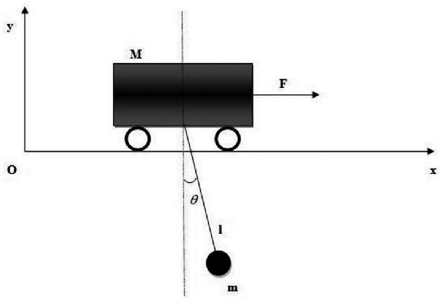
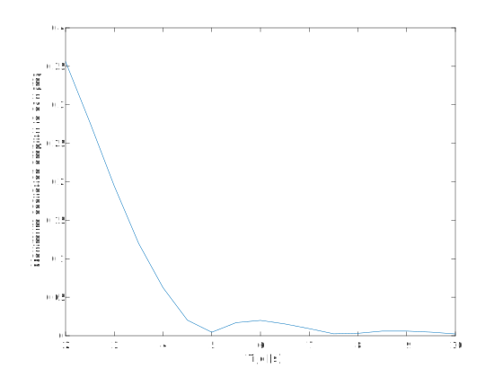
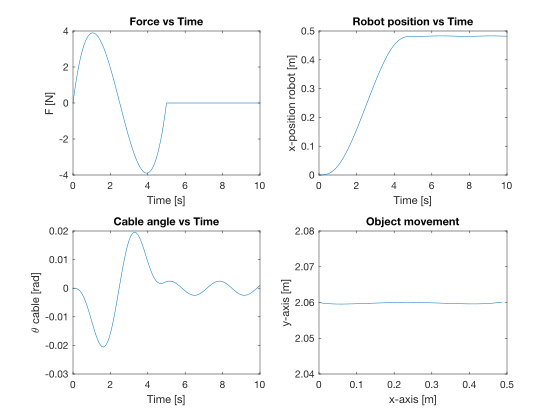

# DYNAMISCHE ANALYSE
## 1.Opstelling

## 2. Langrangiaan opstellen
De Langrangiaan L van het systeem wordt gegeven door L = T - V, waarbij T = de kinetische energie en V = de potentiële energie van het systeem. 

De kinetische energie van het systeem wordt bepaald door de beweging van de slede en de massa onderaan de kabel. De beweging van de massa wordt in functie gezet van de beweging van de slede. De kinetische energie wordt vervolgens:

$T = \frac{1}{2}m (\dot x)^2 + \frac{1}{2}M((\dot x)^2 + l^2 (\dot \theta)^2 + 2 \dot x \dot \theta l cos(\theta))$

De enige potentiële in het systeem zit in de massa onderaan de slinger en wordt gegeven door:

$V = -Mglcos(\theta)$

Hieruit volgt direct de Langrangiaan:
$L = \frac{1}{2}m (\dot x)^2 + \frac{1}{2}M((\dot x)^2 + l^2 (\dot \theta)^2 + 2 \dot x \dot \theta l cos(\theta)) + Mglcos(\theta)$

## 3. Bewegingsvergelijkingen
De bewegingsvergelijkingen kunnen gevonden worden aan de hand van volgende formule:

$\frac{d}{dt}(\frac{\partial L}{\partial \dot q_i}) - \frac{\partial L}{\partial q_i} = Q_i$

met $q_i$ = x of $\theta$ en $Q_i$ de uitwendige kracht. Voor $q_i=x$ wordt dit:

$(M+m)\ddot x + (Mlcos(\theta))\ddot \theta - Ml(\dot \theta)^2 sin(\theta) = F$

Voor $q_i = \theta$ wordt dit:

$Ml(cos(\theta)\ddot x + l\ddot \theta + g sin(\theta)) = 0$

Deze vergelijkingen kunnen vervolgens omgezet worden naar de state space equation:

$\ddot x  = \frac{F + Ml(\dot \theta)^2 sin(\theta) + Mg sin(\theta)cos(\theta)}{M+m-M(cos(\theta))^2}$

$\ddot \theta = \frac{-((F + Ml(\dot \theta)^2 sin(\theta))cos(\theta) + (m+M)g sin(\theta))}{l(M+m-M(cos(\theta))^2)}$

Dit systeem van tweede-orde differentiaal vergelijkingen kan omgezet worden naar een stelsel van eerste-orde differentiaal vergelijkingen door de volgende nieuwe variabelen in te voeren:
$x_1 = x, x_2 = \theta, x_3 = \dot x$ en $x_4 = \dot \theta$. De nieuwe vergelijkingen zijn dan: 

$\dot x_1 = x_3$

$\dot x_2 = x_4$

$\dot x_3  = \frac{F + Ml(x_4)^2 sin(x_2) + Mg sin(x_2)cos(x_2)}{M+m-M(cos(x_2))^2}$

$\dot x_4 = \frac{-((F + Ml(x_4)^2 sin(x_2))cos(x_2) + (m+M)g sin(x_2))}{l(M+m-M(cos(x_2))^2)}$

## 4. Vergelijkingen oplossen
Deze vergelijkingen kunnen opgelost worden naar $x(t)$ en $\theta(t)$ als de kracht op het systeem gekend is met behulp van Matlab. Deze vergelijkingen kunnen door ons gebruikt worden om de horizontale verplaatsing tijdens de initialisatie te simuleren. Hieruit kan gevonden worden hoe snel de beweging uitgevoerd kan worden zonder te grote oscillaties op te wekken.

De bewegingswet voor deze horizontale verplaatsing van de slede wordt gegeven door:

$s(\tau) = 6\tau^5 -15\tau^4 +10\tau^3$

De kracht moet als input meegegeven worden. Dit wordt gedaan door de versnelling te vinden uit de bewegingswet om vervolgens $F(t) = M*a(t)$ te gebruiken. De versnelling van de beweging wordt gegeven door:

$\frac{dS^2}{dt^2} = \frac{L}{T^2} \frac{ds^2}{d \tau ^2}$ met $\tau = \frac{t}{T}$

waarbij L = afstand van de beweging en T = duratie van de beweging. De kracht in verloop van de tijd wordt dan gegeven door:

$F(t) = \frac{M L}{T^2}(120 (\frac{t}{T})^3 - 180 (\frac{t}{T})^2 + 60 (\frac{t}{T}))$

Door dit in te geven kunnen de verlopen $x(t)$ en $\theta(t)$ gevonden worden. Ook de positie van het object is dan gekend door de volgende verbanden:

$x_{object}(t) = x(t) + l*sin(\theta(t))$ 

$y_{object}(t) = l*cos(\theta(t))$

Door deze te plotten kan er nagegaan worden hoe het object zich theoretisch gezien zal verplaatsen. De oplossing is nog afhankelijk van L en T. Als de verhouding $\frac{L}{T^2}$ constant wordt gehouden, is de vorm van de oplossing ook constant. Er kan voor 1 bepaalde afstand L gezocht worden wat de minimaal nodige tijd T is om de beweging gecontroleerd uit te voeren. Als de afstand L dan verandert, wat het geval zal zijn in de praktijk, kan eenvoudig de nieuwe duratie T van de beweging gevonden worden.

## 5. Zoeken van minimale tijd T
Voor een gekozen afstand $L = 0.5m$ wordt de oplossing gezochht voor verschillende tijden T. Als criterium van een 'gecontroleerd' beweging wordt gekeken naar de maximale horizontale oscillatie van het object nadat de slede tot stilstand is gekomen. Dit werd gedaan voor $T = [2:0.5:10]$. Het resultaat is hieronder te zien:

Hieruit blijkt dat voor $T=5s$ de maximale oscillatie amplitude slechts 0.0045m betreft. Dit is volgens ons klein genoeg. Als uit het experiment blijkt dat dit nog te groot is, kan voor een $T=7.5s$ of $T=10s$ gekozen worden die nog kleinere amplitudes vertonen. Voor $T=5s$ is de verhouding $\frac{L}{T^2} = 0.02$. De resultaten van de simulatie met $L=0.5m$ en $T=5s$ zijn hieronder te zien:

De kracht is eerst gegeven door de formule zoals hierboven beschreven. Vervolgens valt de kracht weg en staat de slede stil. Zo kan er gekeken worden naar de oscilaties na de beweging. De slede volgt de gewenste bewegingswet. De hoek $\theta$ blijft zeer beperkt. Het object verplaatst zich op een zo goed als rechte lijn. 