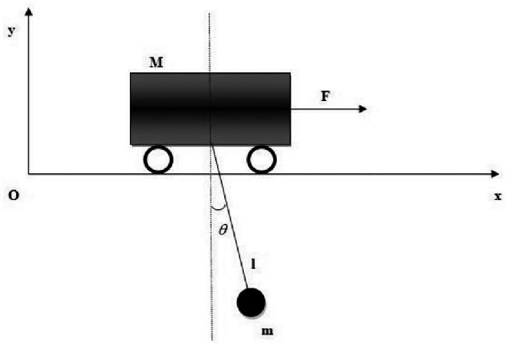
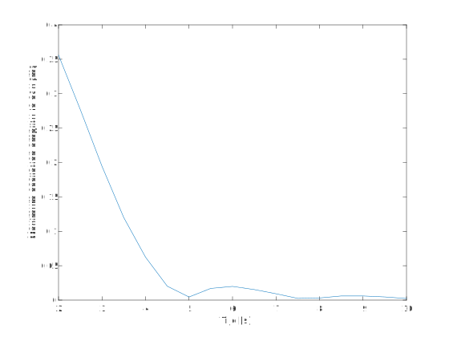
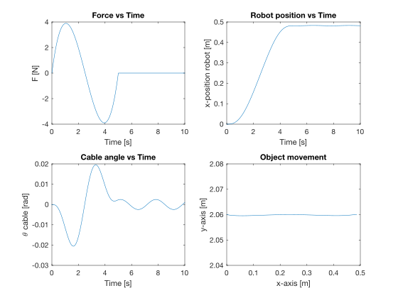

# DYNAMISCHE ANALYSE
## 1.Opstelling

## 2. Langrangiaan opstellen

$T = \frac{1}{2}m (\dot x)^2 + \frac{1}{2}M((\dot x)^2 + l^2 (\dot \theta)^2 + 2 \dot x \dot \theta l cos(\theta))$

$V = -Mglcos(\theta)$

$L = \frac{1}{2}m (\dot x)^2 + \frac{1}{2}M((\dot x)^2 + l^2 (\dot \theta)^2 + 2 \dot x \dot \theta l cos(\theta)) + Mglcos(\theta)$

## 3. Bewegingsvergelijkingen

$\frac{d}{dt}(\frac{\partial L}{\partial \dot q_i}) - \frac{\partial L}{\partial q_i} = Q_i$

 $q_i=x$:

$(M+m)\ddot x + (Mlcos(\theta))\ddot \theta - Ml(\dot \theta)^2 sin(\theta) = F$

$q_i = \theta$:

$Ml(cos(\theta)\ddot x + l\ddot \theta + g sin(\theta)) = 0$

State space equations:

$\ddot x  = \frac{F + Ml(\dot \theta)^2 sin(\theta) + Mg sin(\theta)cos(\theta)}{M+m-M(cos(\theta))^2}$

$\ddot \theta = \frac{-((F + Ml(\dot \theta)^2 sin(\theta))cos(\theta) + (m+M)g sin(\theta))}{l(M+m-M(cos(\theta))^2)}$

Substitutie:

$x_1 = x, x_2 = \theta, x_3 = \dot x$ en $x_4 = \dot \theta$. 

Nieuwe vergelijkingen:

$\dot x_1 = x_3$

$\dot x_2 = x_4$

$\dot x_3  = \frac{F + Ml(x_4)^2 sin(x_2) + Mg sin(x_2)cos(x_2)}{M+m-M(cos(x_2))^2}$

$\dot x_4 = \frac{-((F + Ml(x_4)^2 sin(x_2))cos(x_2) + (m+M)g sin(x_2))}{l(M+m-M(cos(x_2))^2)}$

## 4. Vergelijkingen oplossen

De bewegingswet voor deze horizontale verplaatsing van de slede wordt gegeven door:

$s(\tau) = 6\tau^5 -15\tau^4 +10\tau^3$

De versnelling van de beweging wordt gegeven door:

$\frac{dS^2}{dt^2} = \frac{L}{T^2} \frac{ds^2}{d \tau ^2}$ met $\tau = \frac{t}{T}$

waarbij L = afstand van de beweging en T = duratie van de beweging. De kracht in verloop van de tijd wordt dan gegeven door:

$F(t) = \frac{M L}{T^2}(120 (\frac{t}{T})^3 - 180 (\frac{t}{T})^2 + 60 (\frac{t}{T}))$

$x_{object}(t) = x(t) + l*sin(\theta(t))$ 

$y_{object}(t) = l*cos(\theta(t))$

## 5. Zoeken van minimale tijd T
$L = 0.5m$ 

$T = [2:0.5:10]$

De resultaten van de simulatie met $L=0.5m$ en $T=5s$ zijn hieronder te zien:

