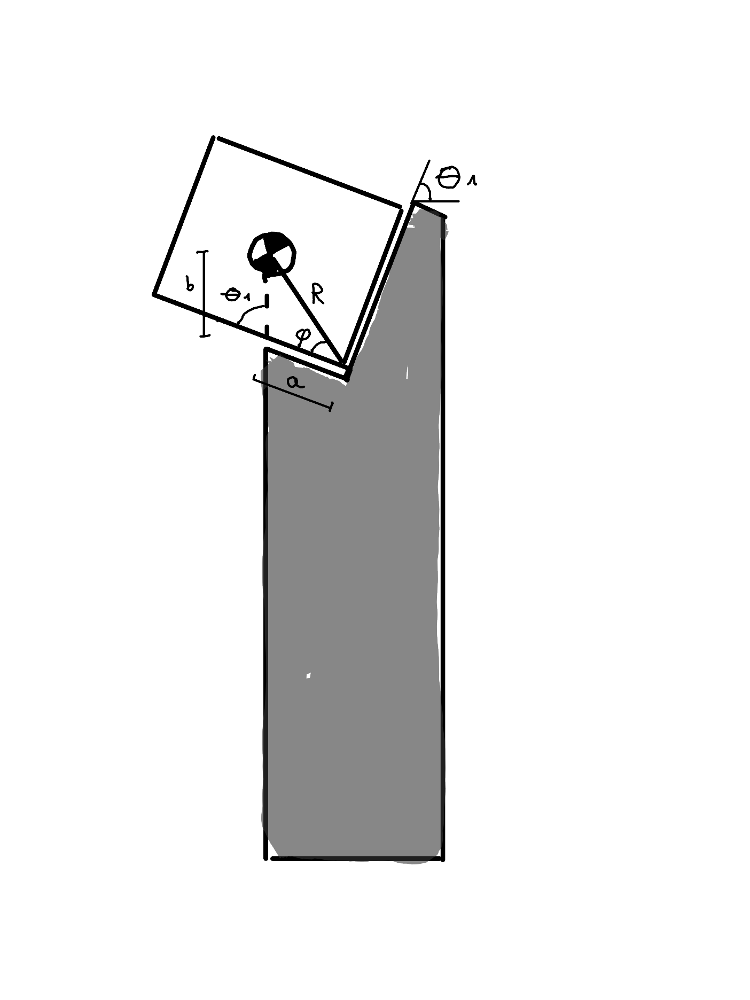

## Proefopstelling  

### Afmetingen  
* Gelijke hoogte begin en eind
* $\Delta x$ = 1m,  $\Delta y$ = 2m  -> kleine hoeken swing 

## Stap 1: initialisatie

### bak dimensies

* h = 24cm
* B = 30cm
* d = 40cm

* $ R = \sqrt{B^2/4 + h^2}$
* $\alpha$ = $bgtan(\frac{B}{2h}) $

### 1. Bak hijsen 
* $\Delta E  = mg\Delta h$
* tijd T = $\frac{\Delta E}{P_{nom}}$

* Bewegingswet keuze:
    - Minimal rms acceleration (3rd degree polynomial)
    - $s(\tau) = 3\tau^2-2\tau^3$
    - $S(t) = \Delta h* s(\tau)$ met $\tau=\frac{t}{T}$
    - $a_{max} = 6\frac{m}{s^2}$
    
    
* Maximale belasting:
    - $a_{max} = \frac{dS^2}{dt^2}_{max} = \frac{\Delta h}{T^2} * 6$
    - $F_{max}$ = massa  bak * $a_{max} $ 

### Bak kantelen 

* $x_2-x_1 = \frac{b}{2}$
* $x_3 - x_2 = R*cos(\alpha+\theta_1)$
* $\Delta x_{kantel} = \frac{b}{2} + R*cos(\alpha + \theta_1)$

### 2. Verplaatsing in x

* Tijd T = 5s (zie dynamische analyse)
* Afstand $\Delta x_{tot} = \Delta x_{1->2} + \Delta x_{kantel}$

* Bewegingswet keuze:
    - 5th degree polynomial 
    - $s(\tau) = 6\tau^5 -15\tau^4 +10\tau^3$
    - S(t) = $\Delta x_{tot}* s(\tau)$ met $\tau=\frac{t}{T}$

### 3. Robot naar Xm = $\frac{x2-x1}{2}$
* Verplaatsing robot $\Delta x_{robot}$ = 0.5m. (zie opstelling)
* Tijd verplaatsing: $ T = \frac{\int{m*v^2}}{2 * P_{nom}}$

* Bewegingswet robot keuze:
    - Minimal rms acceleration (3rd degree polynomial)
    - $s(\tau) = 3\tau^2-2\tau^3$
    - $S(t) = \Delta x_{robot}* s(\tau)$ met $\tau=\frac{t}{T}$

* Bewegingswet kabel:
  vergelijking: cl(t) = $\sqrt{x(t)^2+y^2}$, waarbij x(t) de lineaire beweging van de robot is en y de hoogte van het object.
    - De eindlengte van de kabel is dan cl = $\sqrt{x_1^2+y_1^2}$  
    - De hoek tussen de verticale en de kabel is dan $\theta_1 = bgtan(\frac{y_1}{x_m})$

### 4. Mogelijke problemen
* Bak slingert te hard. 
    * Zie dynamische analyse 
* Bak verplaatsen van zijn startpositie (2 -> 3).
    * Zie rust platform

### 5. Rust platform:
 

* sinusregel om a (=lengte platform) te berekenen:
    * $R = \frac{\sqrt{B^2+h^2}}{2}$
    * $\phi = tan^{-1}(\frac{h}{B})$
    * $\frac{a}{sin(\theta_1 -\phi)} = \frac{\sqrt{B^2+h^2}}{2*sin(180 - \theta_1)}$
    * $a = \frac{\sqrt{B^2+h^2}*sin(\theta_1 -\phi)}{2*sin(180 - \theta_1)}$

## Stap 2 : swing

 

### 1. 1 -> 2
* Totale inkorting: $\Delta cl = \frac{h}{2} + marge$.
* $\Delta E = mg \Delta h = mg (\Delta cl* sin(\theta_1))$
* Duratie inkorting T = $\frac{\Delta E}{P_{nom}}$

* Bewegingswet keuze: 
    - Minimum jerk
    - $s(\tau) = \frac{16}{3}\tau^3    (0<\tau<0.25)$
    - $s(\tau) = -\frac{16}{3}\tau^3 + 8\tau^2 - 2\tau + \frac{1}{6} (0.25<\tau<0.75)$
    - $s(\tau) = \frac{16}{3}\tau^3 - 16\tau^2 + 16\tau -\frac{13}{3} (0.75<\tau<1)$
    - -> $cl(t) = cl_2 + \Delta cl* s(\tau)$

### 2. 2 -> 3
* $\theta_1 = \theta_2$
* Duratie swing halve periode: $T/2 = \pi \sqrt{\frac{cl}{g}}$ 
* Kritische belasting 
    - $ F_t - G = m* a_r$
    - $a_r = v^2/cl$
    - $v = \sqrt{2g(cl-y_1)} $ 
    - $F_t = m(\frac{2g(cl-y_1)}{cl} + g) $

### 3. Mogelijke problemen
* Schok tijdens kabel inkorting 
    * Beweging van de kabel.
    * 2 kabels.
* Ideale eindpositie.
    * verliezen mee in rekening

   
## Stap 3: Landing

### 1. Berekening platform positie:
- halve breedte marge: 
    - $\Delta \theta = 2 sin^{-1}(\frac{B}{4cl}) $ 
    - $\theta_3 = \theta_2 - \Delta \theta$

* Tijd tussen $\theta_2$ en $\theta_3$:
    - $\theta(t) = \theta_0 cos(\sqrt{g/l}t)$
    - $t_2 = \pi \sqrt{\frac{cl}{g}}$ 
    - $\Delta t = \sqrt{l/g}*cos^{-1}(\frac{\theta_3}{\theta_2})$
    - $t_3 = t_2 + \Delta t$

* Linker onderhoek:
    - $x_3 = x_M + cl*sin(\theta_3) - \frac{B}{2}*cos(\theta_3)$
    - $y_3 = cl*cos(\theta_3) + \frac{B}{2}*sin(\theta_3)$
   

* Verticale marge:
    - $marge_1$ = afstand dat bak boven platvorm komt. = $\frac{h}{3}$ (arbitrair)
    - $marge_2$ = afstand dat bak nog verder dan halve hoogte verder moet zakken = $marge_1$

### 2. Beweging van positie 2 -> 3:

* De kabel verlenging tussen $\theta_2$ en $\theta_3$ is dan:
    - $\Delta cl = marge_1 + \frac{h}{2} + marge_2$
    - $\tau = \frac{t}{\sqrt{l/g}*cos^{-1}(\frac{\theta_3}{\theta_2})}$
* Blijf onder valversnelling 
    - max acceleratie: $\frac{dS^2}{dt^2}_{max} = \frac{L}{T^2}*a_{max}$   < g 
    - $a_{max} = 4$ (tabel)    
* Bewegingswet keuze:
    - Minimal acceleration (bang-bang)
    - $s(\tau) = 2\tau^2 (0<\tau<5)$
    - $s(\tau) = -2\tau^2 + 4\tau -1 (0.5<\tau<1)$
    - $cl = cl_2 + s(\tau)*\Delta cl (t_2<t<t_3)$

### 3. Beweging van positie 3 -> eind positie:
 * Eindpositie:
    * $L_p$ = Lengte platform
    * $x_e = x_3 + L_p * cos(\theta_3)$
    * $y_e = y_3 + L_p * sin(\theta_3)$
* Aanpassing kabel lengte:
    * $\Delta cl = \sqrt{(x_e-x_3)^2 + (y_e -y_3)^2}$

* Bewegingswet keuze: Bang-Bang
    - max acceleratie: $\frac{dS^2}{dt^2}_{max} = \frac{L}{T^2}*a_{max}$
    - $a_{max} = 4$ (tabel)  
    - tijd: $T = \sqrt{\frac{a_{max}*L_p}{g*sin(\theta_3)}}$ 
    - $t_4 = t_3 + T$

    - Minimal acceleration (bang-bang)
    - $s(\tau) = 2\tau^2 (0<\tau<0.5)$
    - $s(\tau) = -2\tau^2 + 4\tau -1 (0.5<\tau<1)$
    - $cl = cl_3 + s(\tau)*\Delta cl (t_3<t<t_4)$
    
### Mogelijke problemen:
* Duratie van beweging 2->3 .
    * Pas posities ($x_3$,$y_3$) aan.
    
* Bak komt te hard neer op de landingssteun.
    * Marges verkleinen.

* Orientatie van de bak.
    * extra steun.

* Wrijving

 

