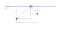

## Modellering van de opstelling

## Specificaties:

### Fysieke limieten robotbereik (opgemeten):
- Breedte: 75 cm
- Lengte: 113 cm
- Hoogte: 270 cm

### Dimensies robot (opgemeten):
- Breedte: 12 cm
- Lengte: 11 cm
- Hoogte: 20 cm

### Bewegingsbereik robot
De robot zal naar gewenste posities gestuurd worden. Om te zorgen dat deze posities binnen de fysieke limieten vallen, worden 
er uiterste waarden meegegeven aan de functie. Bv. in de breedte is er een bereik van 75cm maar de robot zelf is al 12cm breed. Het geometrisch middelpunt van de robot wordt genomen als zijn positie. Dit zijn dan de bereikbare posities in het wereldassenstelsel:  
- x-as (lengte): [5.5cm, 107.5cm]
- z-as (breedte): [6cm, 69cm]
- Kabel lengte (hoogte): [0cm, 250cm] (Kabel hangt onderaan robot, niet in het geometrisch centrum)

### Uiterste waarden objectpositie
Aangezien er een zwaaibeweging geimplementeerd zal worden, kan het object tot buiten het bewegingsbereik van de robot geraken. 
De uiterste posities voor het object zouden berekend moeten worden op basis van een bepaald veiligheidsgebied. De testen gebeuren echter in een open ruimte en de afstanden en snelheden blijven klein genoeg zodat hier geen gevaar kan optreden.

### Motoren:
- Specificaties Motor_kabel: zie model (steppermotor)
- Specificaties Motor_x: zie model (steppermotor)

De motorspecifcaties zijn nodig om te zorgen dat de snelheids- en koppellimieten niet overschreden worden. Indien dit toch het geval is, worden de parameters van de beweging zodanig aangepast dat dit niet meer het geval is. (bv. de totale bewegingstijd wordt verlengd)

### Bout:
- Gewicht: te meten

Het gewicht van de bout zal worden gemeten om de dynamische belasting op het systeem te evalueren en te waarborgen dat de actuatoren en vooral de huidige ophanging van de last deze belasting aankunnen.

### Snelheidsoplegging:
- Maximale snelheid van de lineaire actuator/kabelmotor voor gecontroleerde bewegingen: 0.2*v_max

Alvorens de swing-beweging moet de robot zich verplaatsen om het object te grijpen en zich naar de gewenste constante positie te brengen. Dit zal gebeuren adhv de 'bang-bang' bewegingswet die de versnelling laag houdt. De tijdsduur van de beweging bepaalt de maximale snelheid en die wordt voorlopig op 20% van de maximale snelheid gehouden om zeker te zijn dat de beweging nauwkeurig en gecontroleerd is. De experimenten zullen aantonen of dit aangepast kan/moet worden.

## Ontwerp

### Actuatoren:
- Motor voor x
- Motor voor kabel lengte

### Sensoren:
- Encoder in x
- Encoder in kabel lengte
- Uiteindelijke exacte positiebepaling via gemonteerde camera

### Software:
- Geïmplementeerde functies in C
- Andere software nodig?

### Communicatie:
- 'Path' voor de motoren wordt ingelezen aan 500Hz 
- Tussen code en sensoren / actuatoren?

## Trade-Off's:

- Complexiteit is momenteel gereduceerd voor effectieve resultaten. Deze dient nog omhoog te gaan eens we meer weten over de uitvoering van onze code in de realiteit.
- Is er genoeg aan de berekeningen voor onze code of is er nood aan feedback van de camera?
- Is de bout zwaar genoeg en klein genoeg om gereduceerd te worden tot een punt massa?
- Hoe gaan obstakels zoals randen onze resultaten beïnvloeden?

## Experiment 1:
Het eerste experiment zal de 'Single Swing' beweging testen om een object te verplaatsen volgens de x-as waarbij de begin en eind hoogte hetzelfde zijn. Dit is dus een simpele pendulum, maar door wrijving en niet-perfecties kan het zijn dat het gewenste resultaat niet bereikt wordt.

### Input
- (x0,y0) : positie robot voor de start van het experiment. (opgemeten)
- Kabellengte voor de start. (opgemeten)
- (x1,y1) = (10,20) : beginpositie object
- (x2,y2) = (50,20) : gewenste eindpositie object
- Robot limieten zoals hierboven beschreven.

### Uitvoering
1. Bereken pad voor initialisatie van de positie van de robot van (x0,y0) naar de bout (x_1,y_1) (functie: GenInitPath.c)
2. Voer de beweging uit. Hang de bout vast aan het koord. (functies: main.c, Overhead.c)
3. Bereken het pad en de snelheden voor de motoren om naar (x2,y2) te gaan. (functie: createPath.c)
4. Voer beweging uit. (functies: main.c, Overhead.c)

### Verificatie van het experiment
Code: 
- check of unit tests werken (reeds OK)

Visueel: 
- Wordt de eindpositie bereikt? 
- Hoe groot is de afwijking in eindposities na meerdere uitvoeringen?  
- Hoe goed gelden de assumpties die gemaakt worden in de code, zoals bv. de assumptie dat de kabel ten alle tijden gestrekt is?
- Hoe lang duurt de beweging en is dit een acceptabele tijd? 

### Mogelijke aanpassingen aan ontwerp
Aanpassingen zullen nodig zijn als het object zijn eindpositie niet bereikt en/of de beweging niet naar verwachtingen verloopt. Onze voorspellingen zijn dat dit kan gebeuren door de volgende ontwerpkeuzes:

- Kabellengte snelheid: in het huidig ontwerp gebeurt dit lineair in de tijd over de hele periode. Aanpassen naar kortere tijdsduur met een hogere snelheid.
- Vaste positie robot tijdens swing: aanpassen naar beperkte translatie richting eindpositie.
- Maximale snelheid tijdens initialisatie: verhogen naar waarde >0.2*vmax

## Experiment 2:
Het tweede experiment zal ook de 'Single Swing' beweging testen, nu om een object op een hogere eindpositie te brengen (=lagere y-waarde: zie orientatie y-as). 

### Input
- (x0,y0) : positie robot voor de start van het experiment. (opgemeten)
- Kabellengte voor de start. (opgemeten)
- (x1,y1) = (10,20) : beginpositie object
- (x2,y2) = (50,10) : gewenste eindpositie object
- Robot limieten zoals hierboven beschreven.

### Uitvoering
Zelfde als bij experiment 1.

### Verificatie van het experiment
Zelfde als bij experiment 1.

### Mogelijke aanpassingen aan ontwerp
Zelfde als bij experiment 1.

