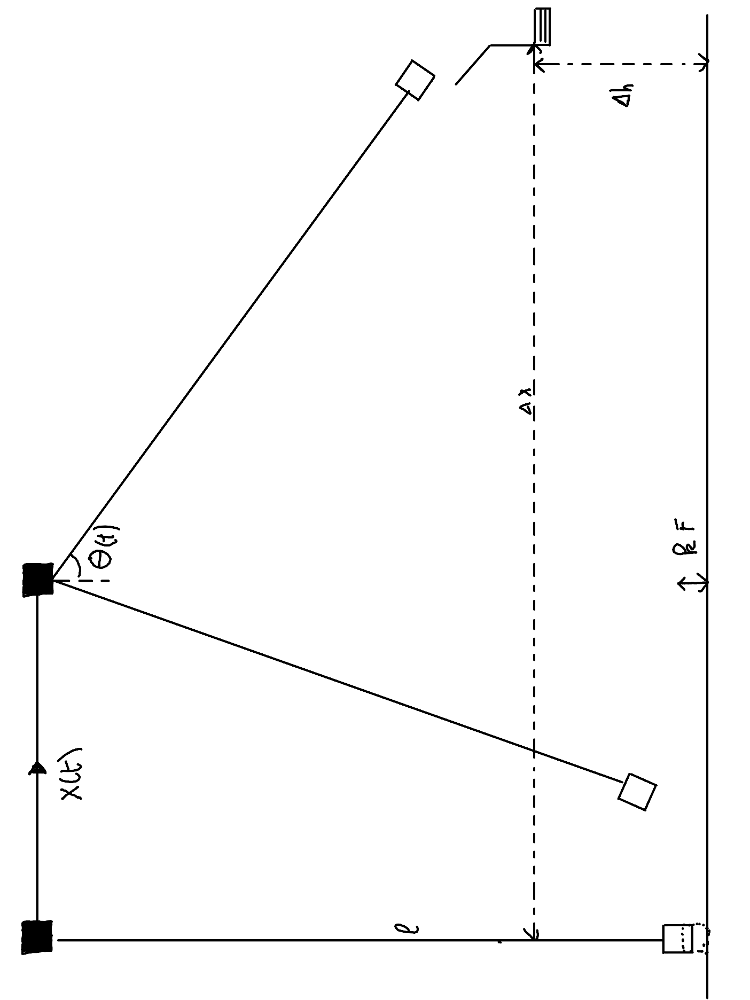
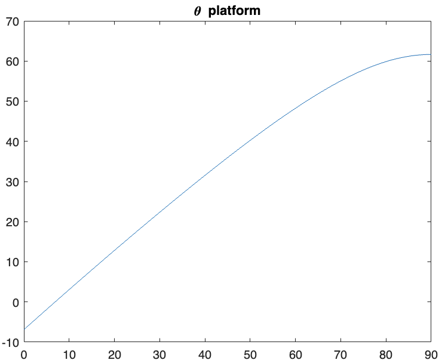
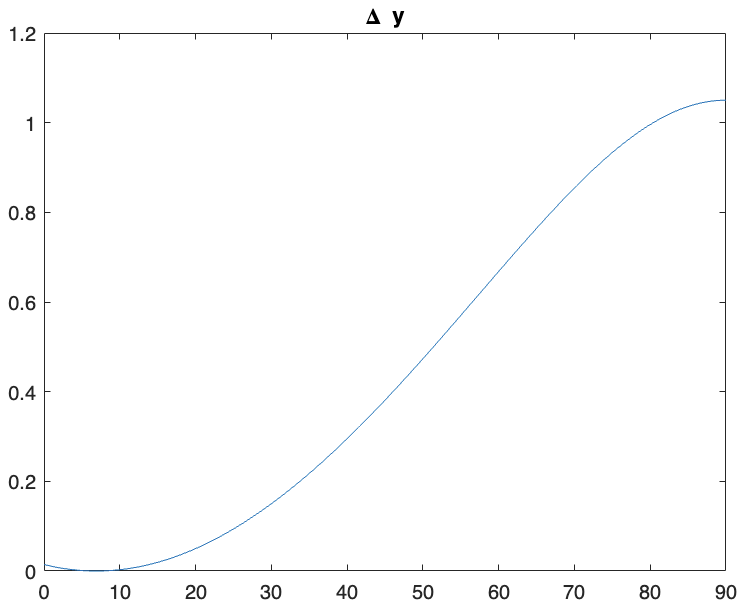
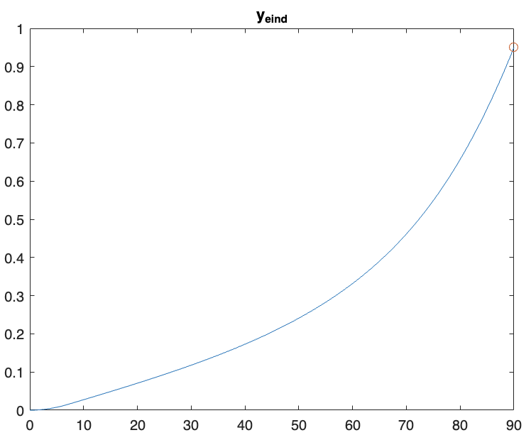

## Opstelling:

    

* Aangezien onze vorige opstelling de verticale hijsbeweging pure arbeid van de motor was. Blijkt dat dit toch niet zo energie efficient is en ook niet zo tijdsefficient. 
* In deze opstelling willen we een hogere eindpositie bereiken zonder te hijsen maar door gebruik te maken van een swing. 
* Qua opstelling valt de start constructie weg en blijft de landingsconstructie nodig, maar nu op een hoogteverschil $\Delta h$ ten opzichte van de start. 
* Uit dynamische vergelijking hebben we  transfer function $\theta / x = \frac{-s^2}{l*s^2 + g}$ afgeleid. Door verschillende $x(t)$ profielen op te leggen, proberen we $\Delta h$ te bereiken met een hoek $\theta < 45°$ zodat de bak niet omkantelt. 
### Verder werk

* Het zoeken naar een optimaal $x(t)$ profiel voor deze opstelling aan de hand van matlab simulaties.
* Berekening maken voor energie om te kunnen vergelijken 

### Input shaping

Om optimaal bewegingsprofiel op te stellen moet er eerst een maximale hoek worden berekend die we willen dat de opstelling behaald.

##  Maximale uitwijking $(\theta = \frac{\pi}{2})$

Maximaal kan de bak tot $ \theta= \pi /2$ komen aangezien de flesjes er zo niet uitvallen. Maar omdat de bak dan geen horizontale snelheidscomponent heeft kan de bak enkel verticaal verplaatsen moest dan de kabel lengte aanpasbaar zijn. Het hoogste platform bevind zich dan net uit de draaicirkel onder de bak. op positie:

* De coordinaat van de linker-onderhoek van de bak bij $\theta_{platform}$ is dan:
    - $x_{platform} = x_M + cl*\sin(\theta_{platform})$
    - $y_{platform} = cl - cl*\cos(\theta_{platform})$

hoek met de verticale
    - $\theta_{platform} = \sin^{-1}(\frac{cl - H_{bak}}{cl})$   komt van  $cl*\sin(\frac{\pi}{2}) - cl*\sin(\theta_{platform}) = H_{bak}$

* De bak zou dan nog moeten gekantelt worden zodat wanneer deze op de loopband terecht komt dat door zwaartekracht recht wordt gezet. 
    - zwaartepunt in midden dus helling van platform is dan kleiner dan $\frac{\pi}{4}$ met de verticale. 
    - neem helling platform 40° met verticale. (een marge van 5°)

* De tijd en afstand 
aangezien het platform er recht onder staat zal het sowieso realiseerbaar zijn. 
De snelheid waarmee de bak dan op het plaform terecht komt is afhankelelijk van het hoogteverschil
    - $\Delta h = cl - cl*\cos(\theta_{platform})$
    - $v_{eind} = \sqrt{2 g \Delta h}$
    - $t = \sqrt{\frac{2 \Delta h}{g}}$

### Toegepast op onze proefopstelling
gegevens
 - $cl = 2m$
 - $H_{bak}=24cm$ 
nieuwe waarden
 - $\theta_{platform} = 1.07586 = 61.64°$
 - $\Delta h =1.05m$
 - $v_{eind} = 4.54 m/s$
  
### Optimalization using matlab.

#### Setting up variables:
- `theta_max`: An array of angles ranging from 0 to 90 degrees

#### Constants:
- `cl`: cable length, a constant value.
- `h_bak`: Height, another constant value.

#### Calculating the platform angle:
- Formula: 
  
  $\theta_{\text{platform}} = \arcsin\left(\frac{cl \times \sin(\theta_{\text{max}}) - h_{\text{bak}}}{cl}\right)$
  
  - This formula calculates the angle of the platform $ ((\theta_{\text{platform}}))$ based on the maximum angle of the platform $((\theta_{\text{max}}))$, the lift coefficient $ ((cl))$, and the height $ ((h_{\text{bak}}))$.

#### Plotting theta_platform:
- This plots the calculated `theta_platform` against `theta_max`.

#### Calculating Delta y:
- Formula:
  $
  \Delta y = cl - cl \times \cos(\theta_{\text{platform}})
  $
  - This formula calculates the change in y-coordinate $(\Delta y)$ based on the lift coefficient $(cl)$ and the angle of the platform $(theta_{\text{platform}})$.

#### Plotting Delta y:
- This plots the calculated `dy` against `theta_max`.

#### Calculating y_eind:
- Formula:
  $
  y_{\text{eind}} = cl - \cos(\theta_{\text{max}}) - \Delta y
  $
  - This formula calculates the final y-coordinate $y_{\text{eind}}$ based on the lift coefficient $cl$, the maximum angle of the platform $\theta_{\text{max}}$, and the change in y-coordinate $\Delta y$.

#### Plotting y_eind:
- This plots the calculated `y_eind` against `theta_max`, highlighting the maximum point.

#### Printing the maximum angle:
- This prints the angle (\(\theta_{\text{max}}\)) corresponding to the maximum `y_eind`.
