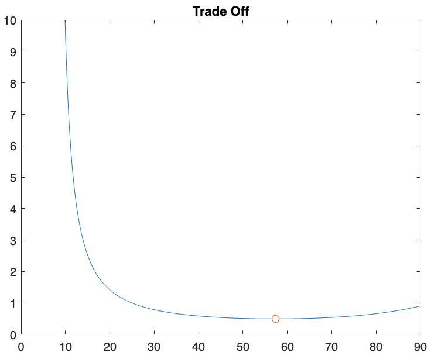
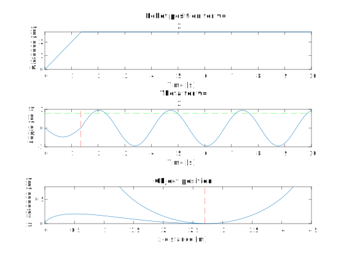
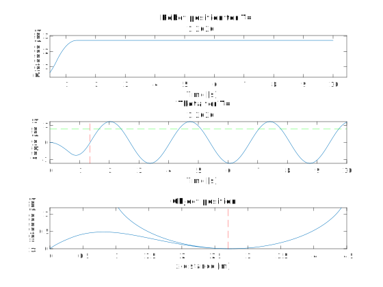

## Opstelling:

    

### Verantwoording nieuwe opstelling
Aangezien onze vorige opstelling de verticale hijsbeweging pure arbeid van de motor was, blijkt dat dit toch niet zo energie efficient is en ook niet zo tijdsefficient. In deze opstelling willen we een hogere eindpositie bereiken zonder te hijsen maar door gebruik te maken van een swing. Qua opstelling valt de start constructie weg en blijft de landingsconstructie nodig, maar nu op een hoogteverschil $\Delta h$ ten opzichte van de start. 

Uit dynamische vergelijking hebben we  transfer function $\frac{\Theta}{X}(s) = \frac{-s^2}{l*s^2 + g}$ afgeleid. Door verschillende $x(t)$ profielen op te leggen aan de robot, kan via simulaties in Matlab het verloop van de hoek van de kabel gevonden worden. Met constante kabellengte, is de positie van het object aan de kabel dan ook geweten. Uit de simulaties kan een eerste voorspelling worden gedaan over de beweging van het object bij een zeker opgelegd profiel van de robot. Deze dienen later uiteraard te verifiëerd worden door middel van experimenten.

### Specificaties opstelling
* Horizontale verplaatsing object = $\Delta x_o = 4m$ (gekozen voor het experiment)

* Constante kabellengte $cl = cl_{max} - F_{max}*k_{kabel} -$ marge $= cl_{max} - \Delta h_1$ . De kabel lengte blijft liefst lang, zo moet het object weinig gehijst worden door pure arbeid van de kabelmotor en is de verplaatsing van het object voor een zekere kabelhoek groter. Echter mag het object niet tegen de grond botsen tijdens de beweging. De kabel heeft een zekere stijfheid $k_{kabel}$ die experimenteel bepaald zal worden. De maximale kracht op de kabel $F_{max}$ tijdens de beweging kan berekend worden. Zo is de uitrekking van de kabel gekend. Daarboven zal nog een marge genomen worden die nog te bepalen is. Deze twee componenten zorgen voor de eerste verticale winst aan hoogte voor het object $\Delta h_1$, weliswaar gerealiseerd door arbeid van de kabelmotor.

* Horizontale verplaatsing robot = $\Delta x_r = \Delta x_o - cl*sin(\theta_f)$. De robot zal logischerwijze minder ver moeten bewegen dan het object. Hoeveel minder is afhankelijk van de kabellengte en $\theta_f$ , de hoek van de kabel op het moment dat het object de gewenste eindpositie bereikt. Deze hoek zal zelf gekozen worden en de opgelegde robotprofielen zullen zo gekozen worden dat deze hoek bereikt wordt als het object op de eindpositie is.

* De keuze van $\theta_f$ heeft verschillende verantwoordingen. Ten eerste mag de hoek niet te groot zijn omdat er dan gevaar kan zijn dat flesjes uit de bak zullen vallen. KIJK BEDENKINGEN PIETER ONDERAAN DOCUMENT. Hier moeten we nog wat meer over nadenken.

* De totale hoogte dat het object zal 'winnen' tijdens de beweging is $\Delta h = \Delta h_1 + \Delta h_2$ met $\Delta h_1$ eerder beschreven en $\Delta h_2 = cl*(1-cos(\theta_f))$.

## Zoeken naar een optimale uitwijkhoek.

###  Maximale uitwijking $(\theta_{opt} = 90°)$

Maximaal kan de bak tot $ \theta= \pi /2$ komen aangezien de flesjes er zo niet uitvallen. Maar omdat de bak dan geen horizontale snelheidscomponent heeft kan de bak enkel verticaal verplaatsen moest dan de kabel lengte aanpasbaar zijn. Het hoogste platform bevind zich dan net uit de draaicirkel onder de bak. op positie:

* De coordinaat van de linker-onderhoek van de bak bij $\theta_{platform}$ is dan:
    - $x_{platform} = x_M + cl*\sin(\theta_{platform})$
    - $y_{platform} = cl - cl*\cos(\theta_{platform})$

hoek met de verticale
    - $\theta_{platform} = \sin^{-1}(\frac{cl - H_{bak}}{cl})$   komt van  $cl*\sin(\frac{\pi}{2}) - cl*\sin(\theta_{platform}) = H_{bak}$

* De bak zou dan nog moeten gekantelt worden zodat wanneer deze op de loopband terecht komt dat door zwaartekracht recht wordt gezet. 
    - zwaartepunt in midden dus helling van platform is dan kleiner dan $\frac{\pi}{4}$ met de verticale. 
    - neem helling platform 40° met verticale. (een marge van 5°)

* De tijd en afstand 
aangezien het platform er recht onder staat zal het sowieso realiseerbaar zijn. 
De snelheid waarmee de bak dan op het plaform terecht komt is afhankelelijk van het hoogteverschil
    - $\Delta h = cl - cl*\cos(\theta_{platform})$
    - $v_{eind} = \sqrt{2 g \Delta h}$
    - $t = \sqrt{\frac{2 \Delta h}{g}}$

#### Toegepast op onze proefopstelling
gegevens
 - $cl = 2m$
 - $H_{bak}=24cm$ 
nieuwe waarden
 - $\theta_{platform} = 1.07586 = 61.64°$
 - $\Delta h =1.05m$
 - $v_{eind} = 4.54 m/s$
  
### Optimalization using matlab.

#### Setting up variables:
- $\theta_{opt}$: An array of angles ranging from 0 to 90 degrees

#### Constants:
- `cl`: cable length, a constant value.
- `h_bak`: Height, another constant value.

#### Calculating the platform angle:
- Formula: 
  
  $\theta_{\text{platform}} = \arcsin\left(\frac{cl \times \sin(\theta_{\text{max}}) - h_{\text{bak}}}{cl}\right)$
  
  - This formula calculates the angle of the platform $ ((\theta_{\text{platform}}))$ based on the maximum angle of the platform $((\theta_{\text{max}}))$, the lift coefficient $ ((cl))$, and the height $ ((h_{\text{bak}}))$.

#### Plotting theta_platform:
- This plots the calculated `theta_platform` against `theta_max`.

#### Calculating Delta y:
- Formula:
  $
  \Delta y = cl - cl \times \cos(\theta_{\text{platform}})
  $
  - This formula calculates the change in y-coordinate $(\Delta y)$ based on the lift coefficient $(cl)$ and the angle of the platform $(theta_{\text{platform}})$.

#### Plotting Delta y which is the height loss:
- This plots the calculated `dy` against `theta_max`.

#### Calculating y_end:
- Formula:
  $
  y_{\text{eind}} = cl - \cos(\theta_{\text{max}}) - \Delta y
  $
  - This formula calculates the final y-coordinate $y_{\text{eind}}$ based on the lift coefficient $cl$, the maximum angle of the platform $\theta_{\text{max}}$, and the change in y-coordinate $\Delta y$.

#### Plotting y_end:
- This plots the calculated `y_end` against `theta_max`, highlighting the maximum point.

####  the maximum angle:
- The maximum is at angle $90°$

#### optimal angle:
- to find the optimal angle, we must do a trade off between tot height gain and height loss. So we will make a variable called `trade_off`that shows the ratio between height loss and height gain. The value of this should be as low as possible. 

- the ideal angle is 57.3°

## Experimenten
### 1. Stijfheid kabel
De kabel waar het object aan hangt heeft een zekere axiale stijfheid $k_{kabel}$. Eerst wordt lengte $l_1$ van de kabel gemeten zonder last. Vervolgens wordt er een last aan de kabel gehangen met gekende massa m. De nieuwe lengte $l_2$ van de kabel wordt nogmaals gemeten. De stijfheid wordt dan vervolgens gevonden door:

$ k_{kabel} = \frac{F}{\Delta x}=\frac{m*g}{l_2-l_1}$

Het experiment kan voor verschillende massa's herhaald worden voor een nauwkeuriger resutaat.

### 2. Robot aansturing
Essentieel aan de opstelling is het vinden van een geschikt verplaatsingsprofiel $x(t)$ of snelheidsprofiel $v(t)$ voor de beweging van de robot, om de gewenste beweging van het object te bereiken. Verschillende soorten profielen worden hiervoor eerst in Matlab gesimuleerd om een eerste voorspelling van de respons van het object te maken. Dit werd gedaan voor de eerder beschreven opstelling, met een kabellengte van 1.8m en $\theta_f = \frac{\pi}{4} rad$. PAS EVENTUEEL THETA F AAN --> OOK RESULTATEN ANDERS DAN UITERAARD. 

De plots van alle resultaten kunnen gevonden worden in de volgende map: [Plots](https://github.com/WannesVertongen/GIP-and-ECS/tree/main/Matlab/Plots). Hieronder worden enkele van de resultaten besproken.

#### 2.1 Constante snelheid
Een eerste profiel dat getest wordt is dat van een 'ramp input', ofwel een beweging met constante snelheid. Hoewel dit snelheidsprofiel in de realiteit nooit exact nageleefd kan worden aangezien het een oneindige versnelling vereist, is het door zijn eenvoud toch interessant om naar te kijken. Verschillende snelheden v worden opgelegd. Hieronder is het resultaat voor $v = 2m/s$ te zien.

Onder elkaar worden respectievelijk de robot positie en hoek $\theta$ in de tijd en het verloop van het object geplot. De rode stippellijn op de onderste twee plots duidt het moment of de plaats aan waarop de robot niet meer beweegd maar stilstaat op zijn eindpositie. De groene stippellijn staat op een hoogte van $\theta_f = \frac{\pi}{4} rad$. We zien dat het object wordt meegesleurd met de robot en dan heen en weer slingert als de robot stilstaat. Het object kan (net) de gewenste horizontale en verticale verplaatsing behalen en dat na iets minder dan 2s. 

De resultaten tonen meteen dat er geen demping of luchtwrijving in het systeem zit. Of dit weldegelijk een correcte vereenvoudiging is, dient nagegaan te worden door het experiment. De 'ramp input' dient opgelegd te worden en vervolgens kan er gekeken worden naar het effectieve verloop van het object. Behaalt het object wel de vereiste hoogte? Blijft het touw wel gestrekt tijdens de zwaaibeweging?

#### 2.2 Constante versnelling & vertraging
Een realistischer profiel voor de robot is een met een constante versnelling gevolgd door een constante vertraging, ook wel gekend als de bang-bang motion law. Een bewegingswet wordt volledig bepaald door de af te leggen afstand, hier $\Delta x_r$ en de duratie van de beweging T. Nu zal er dus een analyse gedaan worden voor verschillende T's. Het resultaat voor T=1.3636s wordt getoond, wat overeenkomt met een gemiddelde snelheid van 2m/s.

Het object bereikt ook in deze simulatie het doel. Deze keer is er een iets grotere marge en dus meer kans om ondanks luchtwrijving het ook effectief te halen. Uiteraard worden deze marges voor hogere snelheden nog groter, maar dan zal de bak ook onder grotere hoeken komen te staan wat voor gevaren kan zorgen.

#### 2.3 7e-graads polynoom
De vorige twee opgelegde profielen waren respectievelijk 1e en 2e orde continu. Onze verwachting waren dat je een niet al te 'gladde' functie nodig had om een grote amplitude swing van het object te verkrijgen. De 7e-graads polynoom is 4e orde continu. Deze werd getest om onze verwachting te testen en hierut blijkt dat deze fout was. Dit profiel kan als enige voor een gemiddelde snelheid van 1m/s toch het object tot gewenste positie krijgen. Een verklaring hiervoor is de hogere pieksnelheid die dit profiel meebrengt. Het resultaat voor T = 2.7272s, wat overeenkomt met gemiddelde snelheid van 1m/s, is hieronder getoond.

De respons van het voorwerp op de verschillende profielen kan vergeleken worden met de voorspellende analyse en met elkaar. Is er effectief zo weinig verschil tussen de profielen? Kan de demping en wrijving effectief worden verwaarloosd en kan dit voor alle profielen?

## Energieverbruik 

????

## Bedenkingen Pieter tijdens schrijven (weg doen op einde)

* Hoek theta_f berekenen op basis van frictie schuine wand? Object moet zeker wel naar beneden glijden . Antwoord van mezelf: hoeft niet per se want ge kunt rollers zetten op de landingswand.
* Liefst ongeveer zero velocity op theta_f?
* Misschien experiment verzinnen om theta_f te kiezen?

