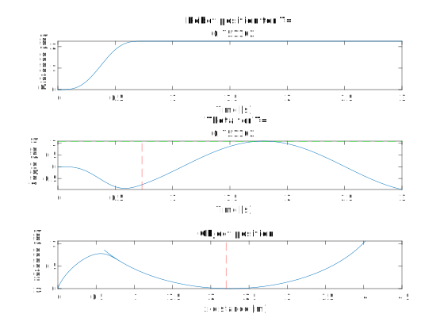

## Opstelling:

    

### Verantwoording nieuwe opstelling
Aangezien onze vorige opstelling de verticale hijsbeweging pure arbeid van de motor was, blijkt dat dit toch niet zo energie efficient is en ook niet zo tijdsefficient. In deze opstelling willen we een hogere eindpositie bereiken zonder te hijsen maar door gebruik te maken van een swing. Qua opstelling valt de start constructie weg en blijft de landingsconstructie nodig, maar nu op een hoogteverschil $\Delta h$ ten opzichte van de start. 

Uit dynamische vergelijking hebben we  transfer function $\frac{\Theta}{X}(s) = \frac{-s^2}{l*s^2 + g}$ afgeleid. Door verschillende $x(t)$ profielen op te leggen aan de robot, kan via simulaties in Matlab het verloop van de hoek van de kabel gevonden worden. Met constante kabellengte, is de positie van het object aan de kabel dan ook geweten. Uit de simulaties kan een eerste voorspelling worden gedaan over de beweging van het object bij een zeker opgelegd profiel van de robot. Deze dienen later uiteraard te verifiëerd worden door middel van experimenten.

### Specificaties opstelling
* Horizontale verplaatsing object = $\Delta x_o = 4m$ (gekozen voor het experiment)

* Constante kabellengte $cl = cl_{max} - F_{max}*k_{kabel} -$ marge $= cl_{max} - \Delta h_1$ . De kabel lengte blijft liefst lang, zo moet het object weinig gehijst worden door pure arbeid van de kabelmotor en is de verplaatsing van het object voor een zekere kabelhoek groter. Echter mag het object niet tegen de grond botsen tijdens de beweging. De kabel heeft een zekere stijfheid $k_{kabel}$ die experimenteel bepaald zal worden. De maximale kracht op de kabel $F_{max}$ tijdens de beweging kan berekend worden. Zo is de uitrekking van de kabel gekend. Daarboven zal nog een marge genomen worden die nog te bepalen is. Deze twee componenten zorgen voor de eerste verticale winst aan hoogte voor het object $\Delta h_1$, weliswaar gerealiseerd door arbeid van de kabelmotor.

* Horizontale verplaatsing robot = $\Delta x_r = \Delta x_o - cl*sin(\theta_f)$. De robot zal logischerwijze minder ver moeten bewegen dan het object. Hoeveel minder is afhankelijk van de kabellengte en $\theta_f$ , de hoek van de kabel op het moment dat het object de gewenste eindpositie bereikt. Deze hoek zal zelf gekozen worden en de opgelegde robotprofielen zullen zo gekozen worden dat deze hoek bereikt wordt als het object op de eindpositie is.

* De keuze van $\theta_f$ heeft verschillende verantwoordingen. Ten eerste mag de hoek niet te groot zijn omdat er dan gevaar kan zijn dat flesjes uit de bak zullen vallen. KIJK BEDENKINGEN PIETER ONDERAAN DOCUMENT. Hier moeten we nog wat meer over nadenken.

* De totale hoogte dat het object zal 'winnen' tijdens de beweging is $\Delta h = \Delta h_1 + \Delta h_2$ met $\Delta h_1$ eerder beschreven en $\Delta h_2 = cl*(1-cos(\theta_f))$.

## Optimalisatie met behulp van MATLAB om $\theta_{opt}$ te vinden.

#### Constanten:
- `cl_1`: kabellengte.
- `h_bak`: hoogte van de bak.

#### Berekening van de hoek waar het platform zal kunnen staan:
- Formule: 
  $\theta_{\text{platform}} = \arcsin\left(\frac{\sin(\theta_{\text{opt}}) \times  (cl - h_{\text{bak}})}{cl}\right)$

  - Deze formule berekent de hoek van het platform $ \theta_{\text{platform}}$ op basis van de optimale hoek van de slingerbeweging $\theta_{\text{opt}}$, de kabellengte $ cl $, en de hoogte $ h_{\text{bak}}$ aan de hand van de geometrie van het probleem. De formule en dus ook de verdergaande analyse is een benadering en geldt enkel voor grotere hoeken ($\theta > 25°)$. 

#### Plotten van theta_platform:
- Hier wordt `theta_platform` geplot tegen `theta_opt`.

#### Berekening van $cl_2$

Na het bereiken van het hoogste punt ($\theta = \theta_{opt}$), wordt de kabel verlengd zodat de bak verticaal naar beneden valt. Door deze verticale val geldt het volgende verband voor de kabellengtes:

$cl_2 = cl_1 * \frac{\sin(\theta_{opt})}{\sin(\theta_{platform})}$

Aangezien $\theta_{platform}$ een benadering is en lineair afhankelijk van $\theta_{opt}$ is, zal $cl_2$ met deze formule een constante zijn, wat niet overeenstemt met de realiteit. Daarom is er ook voor $cl_2$ een benadering gevonden die wel afhankelijk is van de hoek en een realistisch verloop toont. 

$cl_2 = cl_1 + \sqrt{2}*h_{bak}*\sin(\theta_{opt})$

Deze geeft volgend verloop:

#### Berekening van Delta y:
- Formule:
  $
  \Delta y = cl_2* cos(\theta_{platform}) - cl_1*cos(\theta_{opt})
  $
  - Deze formule berekent de verandering in de y-coördinaat $(\Delta y)$ op basis van de kabellengte $(cl)$ en de hoek van het platform $(\theta_{\text{platform}})$. Deze $\Delta y$ kan gezien worden als hoogteverlies. Het platform moet zo veel lager staan om de bak te kunnen opvangen maar niet in het pad van de cirkelbeweging te liggen.

#### Plotten van Delta y:
- Hier wordt `dy` geplot tegen `theta_opt`.

#### Berekening van y_eind:
- Formule:
  $
  y_{\text{eind}} = cl_1 - cl_2 \times \cos(\theta_{\text{platform}})
  $
  - Deze formule berekent de uiteindelijke y-coördinaat $y_{\text{eind}}$ op basis van de kabellengte $cl$, de maximale hoek van het platform $\theta_{\text{max}}$, en de verandering in y-coördinaat $\Delta y$. Deze waarde wordt berekend ten opzichte van het laagste punt van de cirkelbeweging.

#### Plotten van y_eind:
- Hier wordt `y_eind` geplot tegen `theta_opt`, waarbij het maximale punt wordt gemarkeerd.

#### De maximale eind hoogte:
- Het maximum ligt bij een hoek van $90°$

#### Optimale hoek:
- Om de optimale hoek te vinden, moeten we een afweging maken tussen totale hoogtewinst en hoogteverlies. Daarom maken we een variabele genaamd `trade_off` die de verhouding tussen hoogtewinst en hoogteverlies laat zien. De waarde hiervan moet zo groot mogelijk zijn. Bij deze relatie kan er een resultaat komen waarbij het object grote $\Delta y$ kan heeft. Dit zou met zware gewichten zoals bakken bier leiden tot grote schokken in het platform. Daarom krijgt het hoogte verlies een groter gewicht van $150\%$ zodat een optimaal resultaat met een kleinere hoogteval bekomen wordt.

- Trade-off = $\frac{Hoogte\_Winst}{Hoogte\_Verlies^{1.5}}$

- De ideale hoek is 60.85°

#### Samenvatting eindresultaten
 - $\theta_{opt} = 60.85°$
 - $cl_1 = 2m$
 - $cl_2 = 2.8m$
 - $\theta_{platform} = 50.22°$
 - $y_{eind} = 0.531m$

#### Helling platform
* De bak komt gekanteld op het platform terecht en moet uiteindelijk van zelf recht op de loopband komen te staan. Als het massacentrum in het midden van de bak genomen wordt, moet de helling van het platform kleiner zijn dan 45°. Hier moet nog een extra marge (= kleinere hellingshoek) genomen worden voor eventuele onevenwichten in de bak.
  
## Experimenten
### 1. Stijfheid kabel
De kabel waar het object aan hangt heeft een zekere axiale stijfheid $k_{kabel}$. Eerst wordt lengte $l_1$ van de kabel gemeten zonder last. Vervolgens wordt er een last aan de kabel gehangen met gekende massa m. De nieuwe lengte $l_2$ van de kabel wordt nogmaals gemeten. De stijfheid wordt dan vervolgens gevonden door:

$ k_{kabel} = \frac{F}{\Delta x}=\frac{m*g}{l_2-l_1}$

Het experiment kan voor verschillende massa's herhaald worden voor een nauwkeuriger resutaat.

### 2. Robot aansturing
Essentieel aan de opstelling is het vinden van een geschikt verplaatsingsprofiel $x(t)$ of snelheidsprofiel $v(t)$ voor de beweging van de robot, om de gewenste beweging van het object te bereiken. Verschillende soorten profielen worden hiervoor eerst in Matlab gesimuleerd om een eerste voorspelling van de respons van het object te maken. Dit werd gedaan voor de eerder beschreven opstelling, met een kabellengte van 1.8m en $\theta_{opt} = 60.85° $. 

De plots van alle resultaten kunnen gevonden worden in de volgende map: [Plots](https://github.com/WannesVertongen/GIP-and-ECS/tree/main/Matlab/Plots). Hieronder worden enkele van de resultaten besproken.

#### 2.1 Constante snelheid
Een eerste profiel dat getest wordt is dat van een 'ramp input', ofwel een beweging met constante snelheid. Hoewel dit snelheidsprofiel in de realiteit nooit exact nageleefd kan worden aangezien het een oneindige versnelling van de robot vereist, is het door zijn eenvoud toch interessant om naar te kijken. Verschillende snelheden v worden opgelegd. Hieronder is het resultaat voor $v = 5m/s$ te zien.

Onder elkaar worden respectievelijk de robot positie en hoek $\theta$ in de tijd en het verloop van het object geplot. De rode stippellijn op de onderste twee plots duidt het moment of de plaats aan waarop de robot niet meer beweegt, maar stilstaat op zijn eindpositie. De groene stippellijn staat op een hoogte van $\theta_{opt} = 60.85° $. We zien dat het object wordt meegesleurd met de robot en dan oscilleert rondom het rustpunt van de robot. Voor een ramp input is dit de laagste snelheid van de robot waarbij het object nog net de gewenste horizontale en verticale verplaatsing bereikt. Het verloop van de hoek is wel niet bepaald glad wat voor trillingen in de kabel kan zorgen en liefst vermeden wordt.

De resultaten tonen ook meteen dat er geen demping of luchtwrijving in de dynamische vergelijkingen is inbegrepen. Of dit weldegelijk een correcte vereenvoudiging is, dient nagegaan te worden door het experiment. De 'ramp input' dient opgelegd te worden en vervolgens kan er gekeken worden naar het effectieve verloop van het object. Behaalt het object wel de vereiste hoogte? Blijft het touw wel gestrekt tijdens de zwaaibeweging?

#### 2.2 Constante versnelling & vertraging
Een realistischer profiel voor de robot is een met een constante versnelling gevolgd door een constante vertraging, ook wel gekend als de 'bang-bang' motion law. Een bewegingswet wordt bepaald door de af te leggen afstand, hier $\Delta x_r$, en de duratie van de beweging T. Nu zal er dus een analyse gedaan worden voor verschillende T's. Het resultaat voor T=0.751102s wordt getoond, wat overeenkomt met een gemiddelde snelheid van 3m/s.

Het object bereikt nu al voor een lagere snelheid net het doel, weliswaar op een later tijdstip. Een hogere snelheid behaalt uiteraard ook het doel, maar heeft wel een grotere 'overshoot' wat een verspilling van energie is. Dit is 1 van de trade-offs die verder besproken worden. Het verloop van $\theta$ en dus ook van het object is nu veel gladder.

#### 2.3 7e-graads polynoom
De vorige twee opgelegde profielen waren respectievelijk 1e en 2e orde continu. Onze verwachting waren dat je een niet al te 'gladde' functie nodig had om een grote amplitude swing van het object te verkrijgen. De 7e-graads polynoom is 4e orde continu. Deze werd getest om onze verwachting te testen en hieruit blijkt dat deze eigenlijk fout was. Ook dit profiel haalt voor een gemiddelde snelheid van 3m/s het gewenste doel, zelfs met een iets grotere marge, zoals hieronder getoond. De reden hiervoor kan zijn dat dit profiel een hogere pieksnelheid heeft dan de vorige.  

De respons van het voorwerp op de verschillende profielen kan vergeleken worden met de voorspellende analyse en met elkaar. Is er effectief zo weinig verschil tussen de profielen? Heeft het al dan niet gladde verloop van $\theta$ een merkbaar effect op de beweging? Kan de demping en wrijving effectief worden verwaarloosd en kan dit voor alle profielen?

#### 2.4 Trade-off's

De experimenten brengen enkele trade-off met zich mee:

1. Voor elk profiel geldt dat een hogere gemiddelde snelheid zorgt voor een grotere maximale hoek. Er kan gekozen worden voor een $\theta > \theta_{opt}$ om een marge in te bouwen, maar dit gaat wel ten koste van de energie-efficiëntie.

2. Een eenvoudige maar niet onbelangrijke trade-off is de afweging dus duratie van de beweging en energieverbruik, die tegengestelde eisen stellen aan de snelheid.

3. Een eenvoudiger profiel voor de aansturing resulteert in een hogere vereiste snelheid om het doel te halen. Een complexer profiel is dus aantrekklijker op vlak van energie-efficiëntie, maar kan eventueel zorgen voor een moeilijkere aansturing/controller van de robot.

## Energieverbruik 

