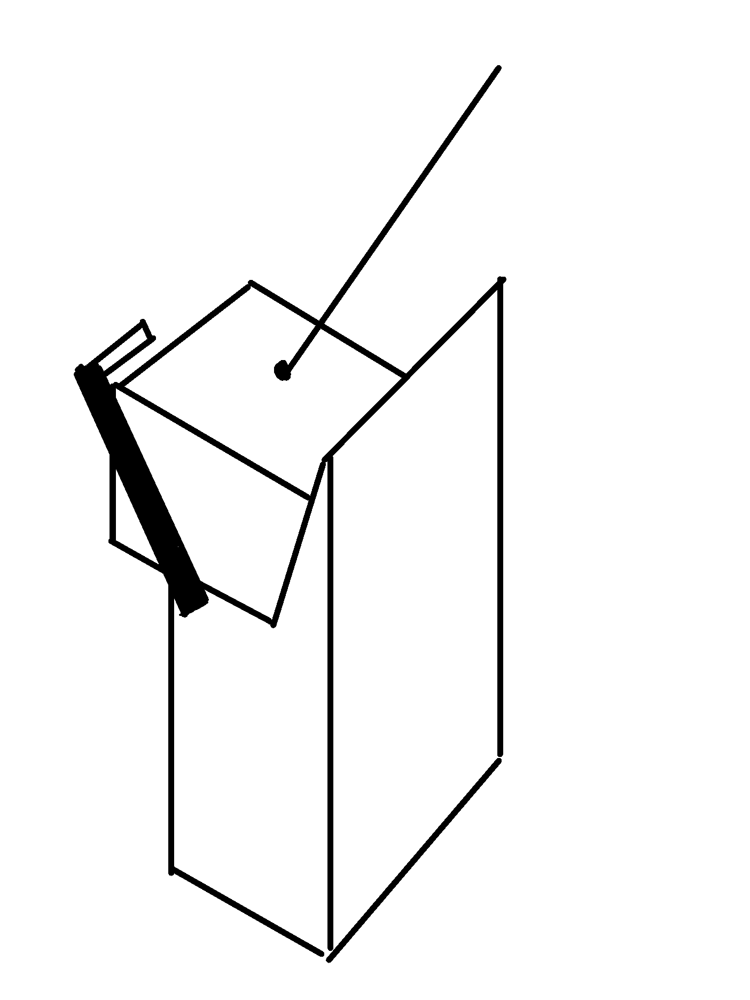
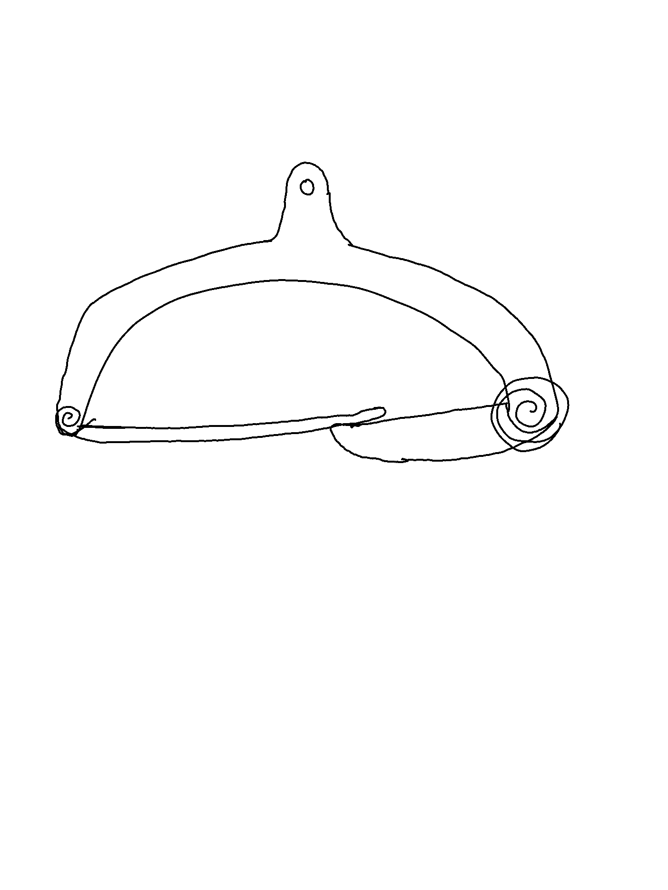
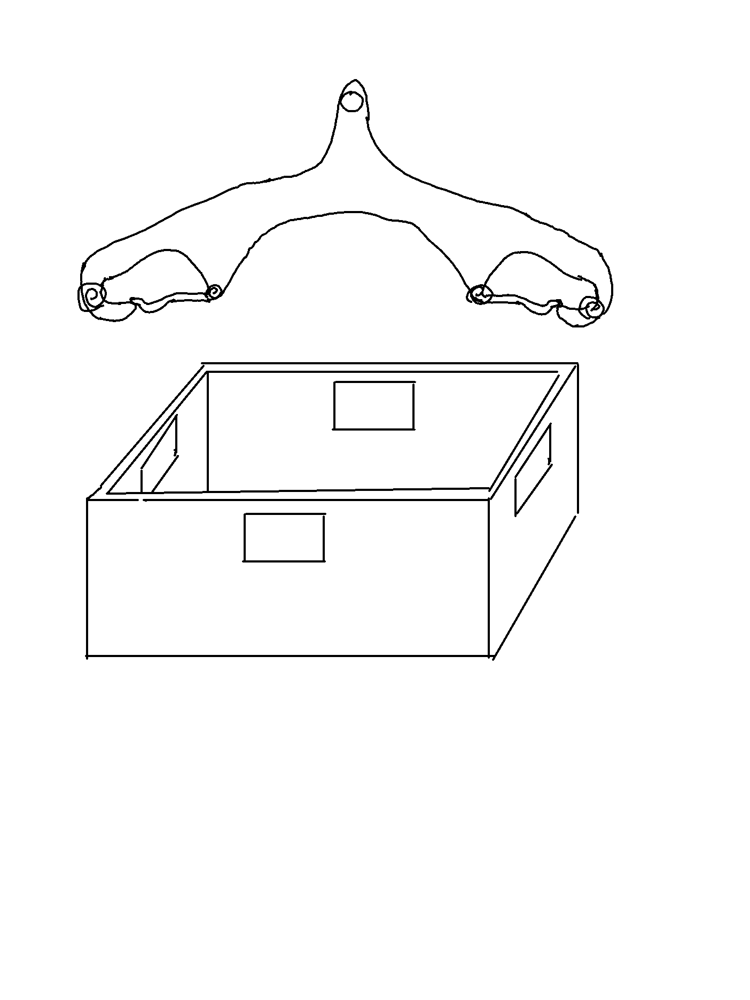
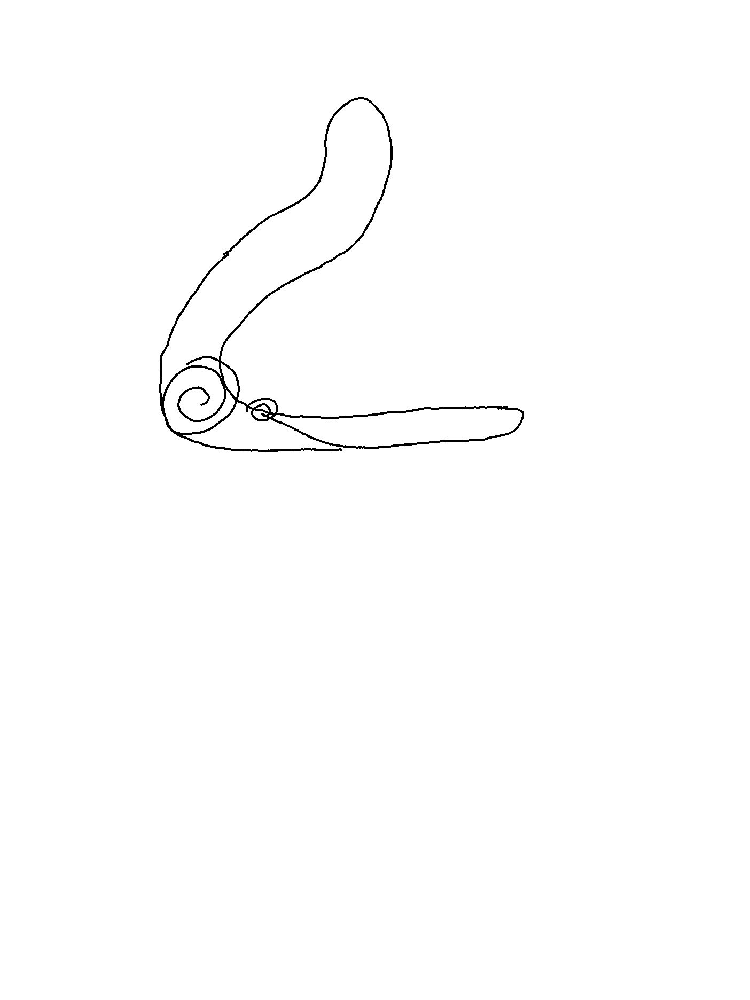
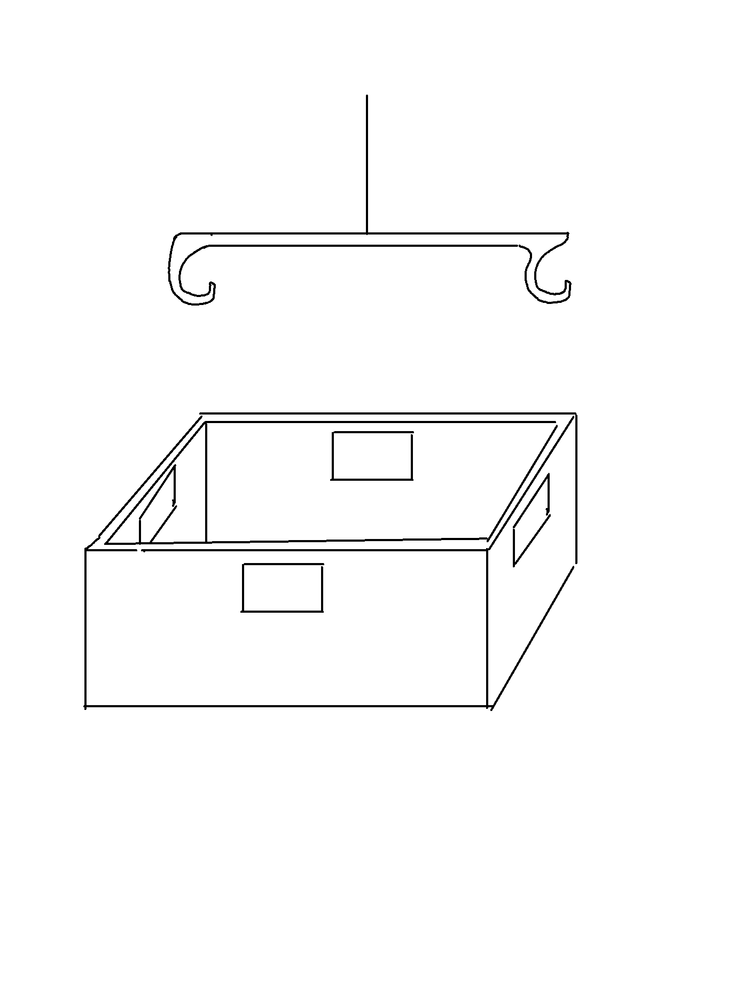
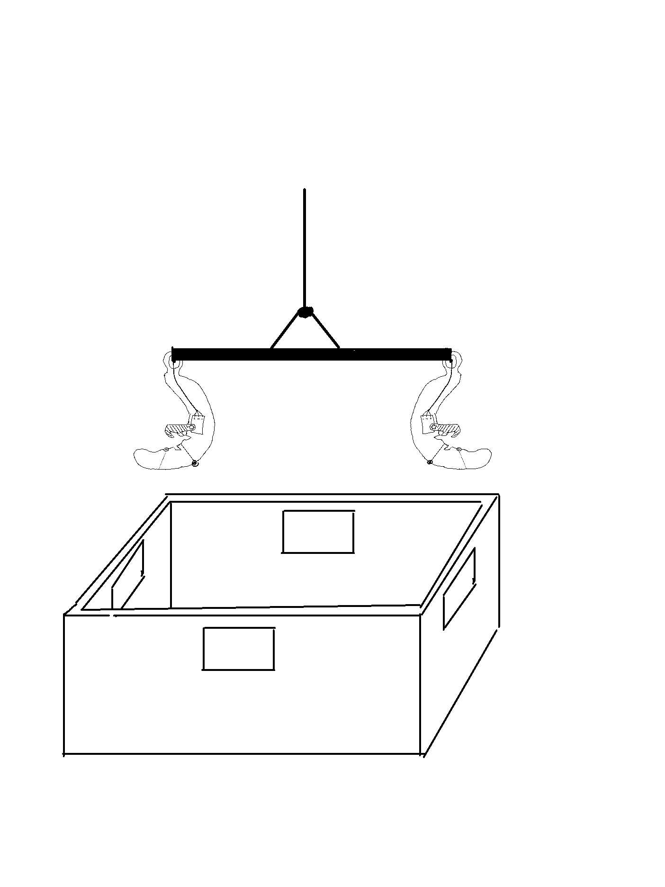
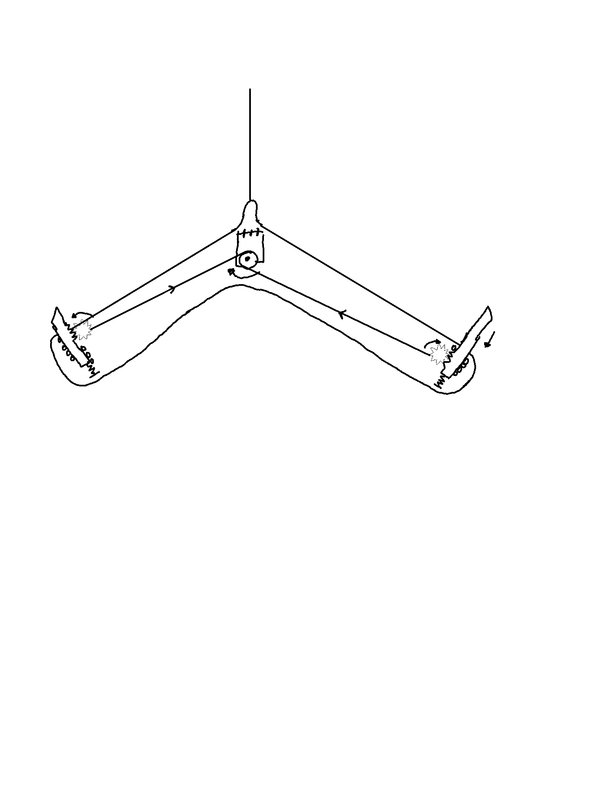

## Opmerkingen presentatie 29/03

1.  Input shaping: gebruik input shaping om horizontale bewegingen robot te maken (vaste tijd)

2. 'Dynamische steun' (weet niet meer wat ze hiermee bedoelen)

3. Afweging tijd vs energie veel meer in rekening brengen! Wanneer tijdsoptimaal, wanneer energie efficiënt. Bereken totaal energieverbruik en vergelijk met energieverbruik van standaard beweging.

4. Start paal: servo in schuine wand --> wand laten kantelen ipv bak eraf trekken. Dimensioneer servo met max koppel nodig.

5. Landing: bakken schuin --> hoe oplossen? Gebruik van een loopband? 

6. Hoe ontwerp aanpassen naar landplaats hoger dan startplaats?

## Oplossingen

#### 1. Input shaping
* Zie documentatie of link voor paper met uitleg [(article)](https://www.researchgate.net/publication/301619730_Input_shaping_Control_of_an_Overhead_Crane/link/58fc4cad4585152eded14367/download?_tp=eyJjb250ZXh0Ijp7ImZpcnN0UGFnZSI6InB1YmxpY2F0aW9uIiwicGFnZSI6InB1YmxpY2F0aW9uIn19) 
* Viskeuze demping volgens x [Ns/m] en volgens kabelhoek [Ns/theta] nodig: hoe inschatten/meten?
* Dynamische vergelijkingen vragen weer om F als input, maar input shaping geeft snelheidsprofiel als input. Hoe oplossen? F=m(dv/dt)?
* Trade-off tussen robuustheid en snelheid

* Dit zorgt voor minimal vibration. Ook gebruikbaar voor juist een swing te genereren?

#### 2.

#### 3. Energie afwegingen

Energieberekening 'standaard' traject:

$E = \int ^T _0 P dt = \int ^T _0 F \dot{x} dt$

Of via sensors op de robot:

$ P = \sqrt{3 V_{rms} I_{rms}}$

Bedenkingen: grootste energieverbruik is in het liften van de last. De horizontale verplaatsing heeft niet zo'n groot verbruik, aangezien de zwaartekracht bijna loodrecht op de verplaatsing staat. Dus ons design bespaart eig helemaal niet zo veel energie op deze manier. Ofwel moeten we dan focussen op tijdsefficiëntie, ofwel moeten we toch meer een ballistic swing gebruiken om aan de last hoger te krijgen zonder het zelf te liften.

Swing wint tijd want geen snelheidslimiet op horizontale verplaatsing. Maar wel tijdsverlies door initialisatie wanneer bak op de steun ligt.

#### 4. Servo in start wand
* Zie papier Pieter: verschillende opties

* Begeleidende staaf (rollement)

#### 5. Bakken schuin in eindpositie
* Simpel op te lossen door zelfde soort paal te gebruiken als bij start zonder steun platform: bovenaan een schuin stuk, gevolgd door een verticaal stuk. Touw zal ervoor zorgen dat de bak tegen de wand aan wordt geduwd bij het verticaal naar beneden schuiven.

* Loopband toevoegen: orientatie bak in eindpositie niet meer zo strict. Wel alle bakken zelfde hoogte --> daarna moeten deze nog gestapeld worden (afhankelijk van de toepassing)

#### 6. Gripper
* Spring clips
* Carabiners
* Spreader beams
* Magnet

* hook system with spring. Automatic attachement and release

* hook updated so that it can clamp from the inside of the box only

* Hook system without springs. Now in need for motion in y:

* System based on carabiners with servo lock instead of spring that clamp from inside of the crate

* System that is driven by 1 servo where the load is taken by the hooks and not the servo's

