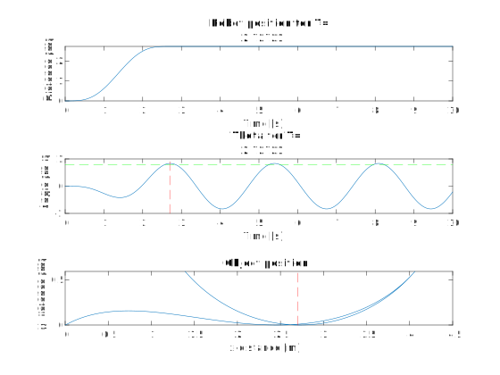

## Experimenten
### 1. Stijfheid kabel
De kabel waar het object aan hangt heeft een zekere axiale stijfheid $k_{kabel}$. Eerst wordt lengte $l_1$ van de kabel gemeten zonder last. Vervolgens wordt er een last aan de kabel gehangen met gekende massa m. De nieuwe lengte $l_2$ van de kabel wordt nogmaals gemeten. De stijfheid wordt dan vervolgens gevonden door:

$ k_{kabel} = \frac{F}{\Delta x}=\frac{m*g}{l_2-l_1}$

Het experiment kan voor verschillende massa's herhaald worden voor een nauwkeuriger resutaat.

### 2. Robot aansturing
Essentieel aan de opstelling is het vinden van een geschikt verplaatsingsprofiel $x(t)$ of snelheidsprofiel $v(t)$ voor de beweging van de robot, om de gewenste beweging van het object te bereiken. Verschillende soorten profielen worden hiervoor eerst in Matlab gesimuleerd om een eerste voorspelling van de respons van het object te maken. Dit werd gedaan voor de eerder beschreven opstelling, met een kabellengte van 1.8m en $\theta_{opt} = 57.3° $. 

De plots van alle resultaten kunnen gevonden worden in de volgende map: [Plots](https://github.com/WannesVertongen/GIP-and-ECS/tree/main/Matlab/Plots). Hieronder worden enkele van de resultaten besproken.

#### 2.1 Constante snelheid
Een eerste profiel dat getest wordt is dat van een 'ramp input', ofwel een beweging met constante snelheid. Hoewel dit snelheidsprofiel in de realiteit nooit exact nageleefd kan worden aangezien het een oneindige versnelling vereist, is het door zijn eenvoud toch interessant om naar te kijken. Verschillende snelheden v worden opgelegd. Hieronder is het resultaat voor $v = 3m/s$ te zien.

Onder elkaar worden respectievelijk de robot positie en hoek $\theta$ in de tijd en het verloop van het object geplot. De rode stippellijn op de onderste twee plots duidt het moment of de plaats aan waarop de robot niet meer beweegd maar stilstaat op zijn eindpositie. De groene stippellijn staat op een hoogte van $\theta_{opt} = 57.3° $. We zien dat het object wordt meegesleurd met de robot en dan heen en weer slingert als de robot stilstaat. Dit is de laagste snelheid van de robot waarbij het object nog net de gewenste horizontale en verticale verplaatsing bereikt. Het verloop van de hoek is wel niet bepaald glad wat 

De resultaten tonen ook meteen dat er geen demping of luchtwrijving in de dynamische vergelijkingen is inbegrepen. Of dit weldegelijk een correcte vereenvoudiging is, dient nagegaan te worden door het experiment. De 'ramp input' dient opgelegd te worden en vervolgens kan er gekeken worden naar het effectieve verloop van het object. Behaalt het object wel de vereiste hoogte? Blijft het touw wel gestrekt tijdens de zwaaibeweging?

#### 2.2 Constante versnelling & vertraging
Een realistischer profiel voor de robot is een met een constante versnelling gevolgd door een constante vertraging, ook wel gekend als de bang-bang motion law. Een bewegingswet wordt bepaald door de af te leggen afstand, $\Delta x_r$, en de duratie van de beweging T. Nu zal er dus een analyse gedaan worden voor verschillende T's. Het resultaat voor T=1.3636s wordt getoond, wat overeenkomt met een gemiddelde snelheid van 2m/s.

Het object bereikt nu al voor een lagere snelheid net het doel, weliswaar op een later tijdstip. Deze keer is er een iets grotere marge en dus meer kans om ondanks luchtwrijving het ook effectief te halen. Uiteraard worden deze marges voor hogere snelheden nog groter, maar dan zal de bak ook onder grotere hoeken komen te staan wat voor gevaren kan zorgen.

#### 2.3 7e-graads polynoom
De vorige twee opgelegde profielen waren respectievelijk 1e en 2e orde continu. Onze verwachting waren dat je een niet al te 'gladde' functie nodig had om een grote amplitude swing van het object te verkrijgen. De 7e-graads polynoom is 4e orde continu. Deze werd getest om onze verwachting te testen en hierut blijkt dat deze fout was. Dit profiel kan als enige voor een gemiddelde snelheid van 1m/s toch het object tot gewenste positie krijgen. Een verklaring hiervoor is de hogere pieksnelheid die dit profiel meebrengt. Het resultaat voor T = 2.7272s, wat overeenkomt met gemiddelde snelheid van 1m/s, is hieronder getoond.

De respons van het voorwerp op de verschillende profielen kan vergeleken worden met de voorspellende analyse en met elkaar. Is er effectief zo weinig verschil tussen de profielen? Kan de demping en wrijving effectief worden verwaarloosd en kan dit voor alle profielen?

## Energieverbruik 

????

