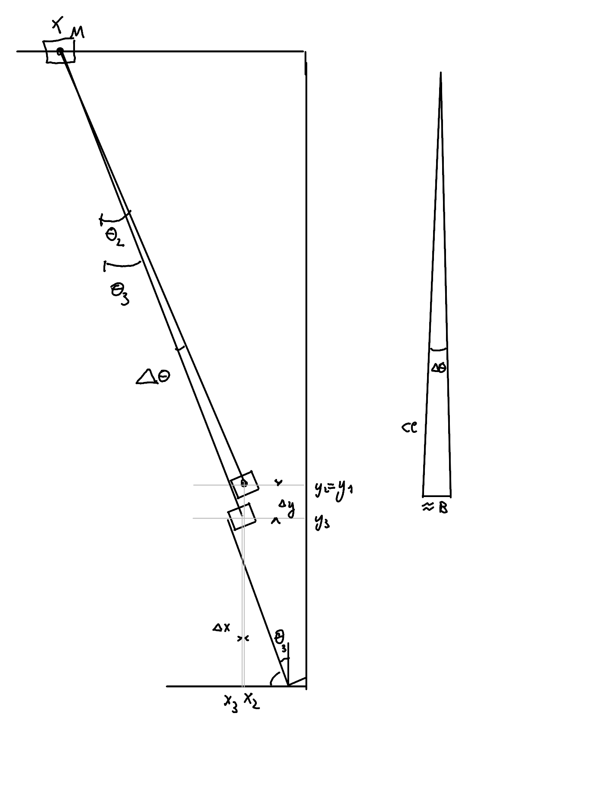

## Proef opstelling  

### Afmetingen  
* Gelijke hoogte begin en eind
* $\Delta x$ = 1m,  $\Delta y$ = 2m  -> kleine hoeken swing 

### Toleranties:
* Positie landingssteun ($x_3,y_2$)
* Hoogte landingssteun
* Ondersteuning tegen kantelen bij start swing

## Stap 1: initialisatie

### bak dimensies

* h = 24cm
* B = 30cm
* d = 40cm

* $ R = \sqrt{B^2/4 + h^2}$
* $\alpha$ = $bgtan(\frac{B}{2h}) $

### 1. Bak hijsen 
* $\Delta E  = mg\Delta h$
* tijd T = $\frac{\Delta E}{P_{nom}}$

* Bewegingswet keuze:
    - Minimal rms acceleration (3rd degree polynomial)
    - $s(\tau) = 3\tau^2-2\tau^3$
    - $S(t) = \Delta h* s(\tau)$ met $\tau=\frac{t}{T}$
    - $a_{max} = 6\frac{m}{s^2}$
    
    

* Bewegingswet verantwoording:
    - Bak ophijsen -> torque-beperking op motor -> beperk versnelling
    - Minimal rms acceleration zorgt voor laagste gemiddelde torque en dus laagste stroomverbruik

* Maximale belasting:
    - $a_{max} = \frac{dS^2}{dt^2}_{max} = \frac{\Delta h}{T^2} * 6$
    - $F_{max}$ = massa  bak * $a_{max} $ 

### Bak kantelen 
* Om te weten hoe ver de robot zich moet verplaatsen volgens de x-as om de start positie te bereiken, wordt er eerst uitgerekend hoeveel de robot moet bewegen om de bak van rechte positie tot schuine positie op de start wand te brengen (zie onderaan tekening initialisatie).

* $x_2-x_1 = \frac{b}{2}$
* $x_3 - x_2 = R*cos(\alpha+\theta_1)$
* $\Delta x_{kantel} = \frac{b}{2} + R*cos(\alpha + \theta_1)$

### 2. Verplaatsing in x
* Theoretisch gezien: geen vermogenverbruik want kracht staat loodrecht op verplaatsing. Vereenvoudiging geldig als beweging gebeurt zonder schommelen van de massa.
* Tijd T = 5s (zelf gekozen, moet traag genoeg gebeuren)
* Afstand $\Delta x_{tot} = \Delta x_{1->2} + \Delta x_{kantel}$

* Bewegingswet keuze:
    - 5th degree polynomial 
    - $s(\tau) = 6\tau^5 -15\tau^4 +10\tau^3$
    - S(t) = $\Delta x_{tot}* s(\tau)$ met $\tau=\frac{t}{T}$

* Beweginswet verantwoording:
    - Lage eindsnelheid nodig voor tijdens het kantelen van de bak.
    - Beperkte versnelling en jerk nodig zodat bak niet schommelt en/of kabel niet trilt.
    - In vergelijking met andere functies van continuïteits graad 3: laagste piek snelheid, piek versnelling en rms versnelling.

### 3. Robot naar Xm = $\frac{x2-x1}{2}$
* Robot wordt exact in het midden tussen start en eind geplaatst zodat er zich een eenvoudige pendulum beweging voordoet.
* Tijdens het verplaatsen van de robot naar $x_m$ moet de kabel zich zo verlengen dat het object op zijn huidige positie blijft liggen.
* Verplaatsing robot $\Delta x_{robot}$ = 0.5m.
* Tijd verplaatsing = 5s (gekozen voor het experiment)

* Bewegingswet robot keuze:
    - Minimal rms acceleration (3rd degree polynomial)
    - $s(\tau) = 3\tau^2-2\tau^3$
    - $S(t) = \Delta x_{robot}* s(\tau)$ met $\tau=\frac{t}{T}$

* Bewegingswet robot verantwoording:
    - Kabelmotor heeft constante load dus geen dynamische koppel-restricties
    - Laagste rms versnelling dus minste stroomverbruik
    - Lage pieksnelheid zodat snelheidsbeperking motor niet wordt overschreden

* Bewegingswet kabel:
    - De kabel moet ten alle tijden lichtjes gespannen zijn, zodat het object niet valt maar ook niet beweegt. De kabel zal daarom verlengen aan de hand van volgende vergelijking: cl(t) = $\sqrt{x(t)^2+y^2}$, waarbij x(t) de lineaire beweging van de robot is en y de hoogte van het object.
    - De eindlengte van de kabel is dan cl = $\sqrt{x_1^2+y_1^2}$  
    - De hoek tussen de verticale en de kabel is dan $\theta_1 = bgtan(\frac{y_1}{x_m})$

### 4. Mogelijke problemen
* Bak slingert te hard waardoor er grote krachten op de wand kunnen komen bij contact. 
    * Duratie van de beweging verlengen of bewegingswet aanpassen. 
* Bij het bewegen van de slede van positie 3 naar positie $x_m$, kan de bak verplaatsen van zijn startpositie.
    * Installeren van extra steun loodrecht op de schuine wand waarop bak kan rusten.

### 5. Rust platform:
 

* sinusregel om a (=lengte platform) te berekenen:
    * $R = \frac{\sqrt{B^2+h^2}}{2}$
    * $\phi = tan^{-1}(\frac{h}{B})$
    * $\frac{a}{sin(\theta_1 -\phi)} = \frac{\sqrt{B^2+h^2}}{2*sin(180 - \theta_1)}$
    * $a = \frac{\sqrt{B^2+h^2}*sin(\theta_1 -\phi)}{2*sin(180 - \theta_1)}$

## Stap 2 : swing

 

### 1. 1 -> 2
* De kabel lengte moet kort ingetrokken worden om de bak van de steun te krijgen en aan de swing beweging te kunnen laten starten. Een begeleidingsstaaf zal zorgen dat de bak niet omkantelt rond zijn contactpunt met de schuine steun.
* Totale inkorting: $\Delta cl = h + marge$. Schuine steun is juist 'h' groot, maar mogelijkheid dat bak niet exact juist ligt. We kiezen daarom een marge van grootte h/4 (25%).
* $\Delta E = mg \Delta h = mg (\Delta cl* cos(\theta_1))$
* Duratie inkorting T = $\frac{\Delta E}{P_{nom}}$

* Bewegingswet keuze: 
    - Minimum jerk
    - $s(\tau) = \frac{16}{3}\tau^3    (0<\tau<0.25)$
    - $s(\tau) = -\frac{16}{3}\tau^3 + 8\tau^2 - 2\tau + \frac{1}{6} (0.25<\tau<0.75)$
    - $s(\tau) = \frac{16}{3}\tau^3 - 16\tau^2 + 16\tau -\frac{13}{3} (0.75<\tau<1)$
    - -> $cl(t) = cl_2 + \Delta cl* s(\tau)$

* Bewegingswet verantwoording: 
    - Inkorting gebeurt op korte tijd dus zal als een schok gebeuren. Om te zorgen dat er geen ongewenste trillingen in het systeem komen, is er gekozen voor minimale ruk.
    - De versnelling is hoog, wat zorgt voor een groot genoege kracht om de wrijving van de steun te overwinnen. Deze wrijvingskracht is niet groot aangezien de hoek $\theta_1$ groot is.

### 2. 2 -> 3
* $\theta_1 = \theta_2$
* Duratie swing halve periode: $T/2 = \pi \sqrt{\frac{cl}{g}}$ 
* Kritische belasting 
    - $ F_t - G = m* a_r$
    - $a_r = v^2/cl$
    - $v = \sqrt{2g(cl-y_1)} $ 
    - $F_t = m(\frac{2g(cl-y_1)}{cl} + g) $

### 3. Mogelijke problemen
* Schok tijdens kabel inkorting niet snel genoeg waardoor bak al kantelt voor slingerbeweging. Dit creeërt een lokale periodische beweging dat de slingerbeweging beïnvloed.
    * Beweging van de kabel aanpassen naar een sneller verloop indien haalbaar, of kabel inkorting laten aanhouden over grote afstand.
    * Werk met 2 kabels aan de bak om orientatie te controleren.
* Ideale eindpositie wordt niet bereikt wegens verliezen tijdens slinger beweging.
    * Breng verliezen mee in rekening bij bepalen eindpositie.

   
## Stap 3: Landing

### 1. Berekening platform positie:
* Er moet marge ingerekend worden zodat object zeker hoog genoeg komt, maar $\theta_1 = \theta_2$, dus landingswand moet lager en meer naar links.

* Voor de eerste marge laten we de bak een halve breedte verder doorvliegen. Dit resulteert in een nieuwe eindhoek $\theta_3$:
    - halve breedte marge: 
        - $\Delta \theta = 2 sin^{-1}(\frac{B}{4cl}) $ 
        - $\theta_3 = \theta_2 - \Delta \theta$

* Tijd tussen $\theta_2$ en $\theta_3$:
    - $\theta(t) = \theta_0 cos(\sqrt{g/l}t)$
    - $t_2 = \pi \sqrt{\frac{cl}{g}}$ 
    - $\Delta t = \sqrt{l/g}*cos^{-1}(\frac{\theta_3}{\theta_2})$
    - $t_3 = t_2 + \Delta t$

* De coordinaat van de linker-onderhoek van de bak bij $\theta_3$ is dan:
    - $x_3 = x_M + cl*sin(\theta_3) - \frac{B}{2}*cos(\theta_3)$
    - $y_3 = cl*cos(\theta_3) + \frac{B}{2}*sin(\theta_3)$
   

* Ten slotte wordt er nog een marge ingerekend zodat de bak niet tegen de rand van de steunwand bots in de heenzwaai:
    - $marge_1$ = afstand dat bak boven platvorm komt. = $\frac{h}{3}$ (arbitrair)
    - $marge_2$ = afstand dat bak nog verder dan halve hoogte verder moet zakken = $marge_1$

### 2. Beweging van positie 2 -> 3:

* De kabel verlenging tussen $\theta_2$ en $\theta_3$ is dan:
    - $\Delta cl = marge_1 + \frac{h}{2} + marge_2$
    - $\tau = \frac{t}{\sqrt{l/g}*cos^{-1}(\frac{\theta_3}{\theta_2})}$

* Bewegingswet keuze:
    - Minimal acceleration (bang-bang)
    - $s(\tau) = 2\tau^2 (0<\tau<5)$
    - $s(\tau) = -2\tau^2 + 4\tau -1 (0.5<\tau<1)$
    - $cl = cl_2 + s(\tau)*\Delta cl (t_2<t<t_3)$

* Bewegingswet verantwoording:
    - De beweging gebeurt snel. Om de schok te minimaliseren wordt voor een minimale versnellingen gekozen.

### 3. Beweging van positie 3 -> eind positie:
 * Eindpositie:
    * $L_p$ = Lengte platform
    * $x_e = x_3 + L_p * cos(\theta_3)$
    * $y_e = y_3 + L_p * sin(\theta_3)$
* Aanpassing kabel lengte:
    * $\Delta cl = \sqrt{(x_e-x_3)^2 + (y_e -y3)^2}$

* Bewegingswet keuze: Bang-Bang
    - max acceleratie: $\frac{dS^2}{dt^2}_{max} = \frac{L}{T^2}*a_{max}$
    - tijd: $T = \sqrt{\frac{a_{max}*L_p}{g*sin(\theta_3)}}$ 
    - $t_4 = t_3 + T$

    - Minimal acceleration (bang-bang)
    - $s(\tau) = 2\tau^2 (0<\tau<0.5)$
    - $s(\tau) = -2\tau^2 + 4\tau -1 (0.5<\tau<1)$
    - $cl = cl_3 + s(\tau)*\Delta cl (t_3<t<t_4)$

* Bewegingswet verantwoording:
    - De beweging gebeurt snel. Gekozen om laagste piek stroom in motor te creëren.
    - Tijd is gekozen om onder de val versnelling langsheen het platform te blijven. 

    
### Mogelijke problemen:
* Duratie van beweging 2->3 te kort waardoor de kabel mogelijk niet meer gespannen is.
    * Pas posities ($x_3$,$y_3$) aan zodat er genoeg tijd is om deze beweging uit te voeren met gespannen kabel. 
    
* Bak komt te hard neer op de landingssteun waardoor flesjes beschadigd geraken.
    * Marges verkleinen zodat 'val'afstand verkleint.

* Orientatie van de bak is niet correct.
    * Voeg extra steun toe aan rechterkant om juiste oriëntatie op te leggen.

* Momenteel geen rekening gehouden met wrijving op de wand voor het berekenen van de val duur. 
    * Wrijving wel in rekening nemen. 

 

